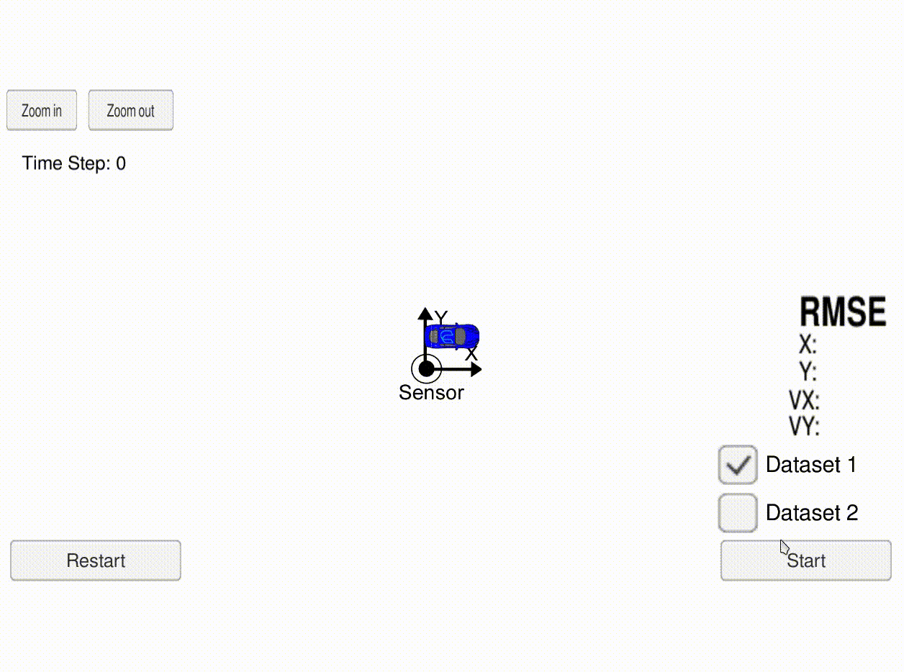

# Self Driving Car: Sensor Fusion
The goal of this project is to utilize an extended Kalman filter to estimate the state of a moving vehicle with noisy LIDAR and RADAR measurements.

## Requirments
- gcc >= 5.4
- cmake >= 3.5
- make >= 4.1 (Linux, Mac), 3.81 (Windows)
- [uWebSocketIO](https://github.com/uWebSockets/uWebSockets)
- [Udacity Simulator](https://github.com/udacity/self-driving-car-sim/releases).

## Build Instructions
1. mkdir build
2. cd build
3. cmake ..
4. make
5. ./ExtendedKF

Then run the simulator and load up the EKF environment.

